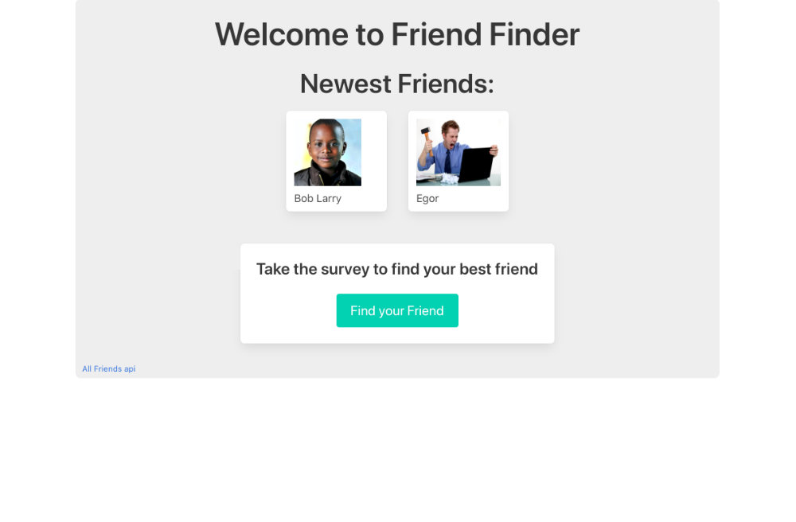

# Frind Finder App
Because everyone could use another friend 😉

## Technology
* Nodejs
* Expressjs
* Sequelize
* MySQL
* jQuery
* Bulma
Built on nodejs with a mysql database (handled by sequelize ROM) for storing all the persistent data for potential friend finding. Node handles all the heavy logic with expressjs running the webserver routing requests. JQuery handles the form data and display of the database queries to the page with help from Bulma for the bulk of the styling on this project.

## Challenges
The logic was a bit tricky doing a comparison question by question followed by aggregating and comparing on a friend by friend basis. The combination of database queries, inserts and logic loops handling the calculations turned out longer and more complex than originally anticipated. Following that there were some challenges getting everything running on Heroku with the database credentials do to conflicting methods of environment handling.

### How it works
The home page lists the 2 most recent entries of the database. Each new survey gets entered into that database and added to the calculations. Do to some of of the logic used it's possible there may be some odd results under high traffic. Additional database queries and promise chaining would be necessary to properly handle that vs just not comparing against the most recent entry (otherwise surveyors would always match to themselves hah!). Additional logi could be added at a later date to handle the possibility of multiple responses.

